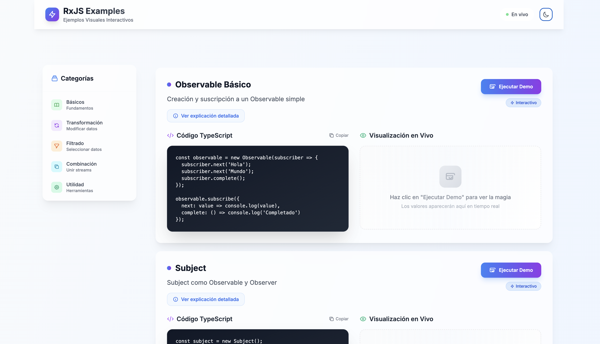
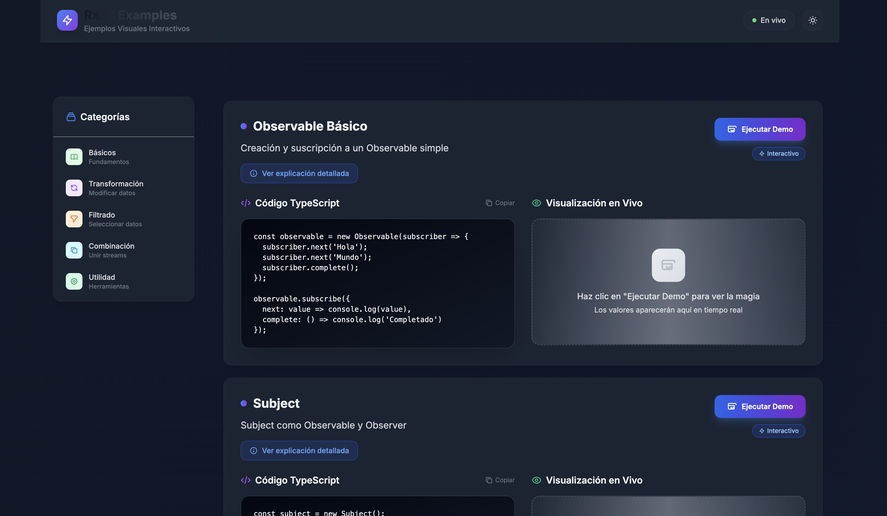
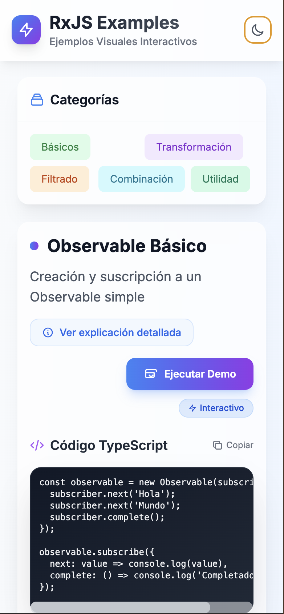

# 🚀 RxJS Examples - Ejemplos Visuales Interactivos

Una aplicación web moderna que demuestra el poder de RxJS a través de ejemplos visuales e interactivos. Construida con TypeScript, Vite y Tailwind CSS.

## ✨ Características

- **Ejemplos Interactivos**: Más de 30 ejemplos de RxJS organizados por categorías
- **Visualización en Tiempo Real**: Ve cómo fluyen los datos a través de los streams
- **Modo Oscuro**: Interfaz adaptable con tema claro y oscuro
- **Responsive**: Funciona perfectamente en desktop y móvil
- **Explicaciones Detalladas**: Cada ejemplo incluye explicaciones amigables

## 🎯 Categorías de Ejemplos

### 📚 Básicos
- Observable, Subject, BehaviorSubject, ReplaySubject
- Interval, Timer, Of, From, Range
- Observables especiales (EMPTY, NEVER, throwError)

### 🔄 Transformación
- Map, MapTo, Pluck, SwitchMap, MergeMap, ConcatMap
- Scan, Reduce

### 🔍 Filtrado
- Filter, DebounceTime, DistinctUntilChanged, Distinct
- ThrottleTime, First, Last, Take, Skip
- TakeWhile, SkipWhile, TakeUntil, SkipUntil

### 🤝 Combinación
- Merge, CombineLatest, Zip, Concat, Race
- ForkJoin, WithLatestFrom, StartWith, Pairwise

### 🛠️ Utilidad
- Tap, CatchError, Retry, Finalize, Timeout
- DefaultIfEmpty, IsEmpty, Every, Find, Share

## 🚀 Inicio Rápido

### Prerrequisitos
- Node.js (versión 16 o superior)
- npm o yarn

### Instalación

1. Clona el repositorio:
\`\`\`bash
git clone https://github.com/tu-usuario/rxjs-examples.git
cd rxjs-examples
\`\`\`

2. Instala las dependencias:
\`\`\`bash
npm install
\`\`\`

3. Inicia el servidor de desarrollo:
\`\`\`bash
npm run dev
\`\`\`

4. Abre tu navegador en \`http://localhost:5173\`

## 🏗️ Scripts Disponibles

- \`npm run dev\` - Inicia el servidor de desarrollo
- \`npm run build\` - Construye la aplicación para producción
- \`npm run preview\` - Previsualiza la construcción de producción
- \`npm run deploy\` - Despliega a GitHub Pages

## 🛠️ Tecnologías Utilizadas

- **[RxJS](https://rxjs.dev/)** - Programación reactiva con Observables
- **[TypeScript](https://www.typescriptlang.org/)** - JavaScript con tipos estáticos
- **[Vite](https://vitejs.dev/)** - Herramienta de construcción rápida
- **[Tailwind CSS](https://tailwindcss.com/)** - Framework de CSS utilitario
- **[PostCSS](https://postcss.org/)** - Procesador de CSS

## 📱 Características de la Interfaz

- **Diseño Glassmorphism**: Efectos modernos de cristal y transparencia
- **Animaciones Suaves**: Transiciones y efectos visuales elegantes
- **Layout Responsivo**: Sidebar fijo en desktop, navegación móvil en tablets/móviles
- **Tema Adaptable**: Modo claro y oscuro con persistencia local
- **Visualización de Streams**: Elementos animados que muestran el flujo de datos

## 🎨 Capturas de Pantalla

### Modo Claro

### Modo Oscuro

### Vista Móvil

## 🤝 Contribuir

Las contribuciones son bienvenidas. Para cambios importantes:

1. Fork el proyecto
2. Crea una rama para tu feature (\`git checkout -b feature/AmazingFeature\`)
3. Commit tus cambios (\`git commit -m 'Add some AmazingFeature'\`)
4. Push a la rama (\`git push origin feature/AmazingFeature\`)
5. Abre un Pull Request

## 📄 Licencia

Este proyecto está bajo la Licencia MIT. Ver el archivo \`LICENSE\` para más detalles.

## 🙏 Agradecimientos

- [RxJS Team](https://github.com/ReactiveX/rxjs) por esta increíble librería
- [Tailwind CSS](https://tailwindcss.com/) por el framework de CSS
- [Vite](https://vitejs.dev/) por la herramienta de desarrollo

Link del Proyecto: [https://github.com/juanarrow/rxjs-examples](https://github.com/tu-usuario/rxjs-examples)

---

⭐ ¡Dale una estrella al proyecto si te ha sido útil!
